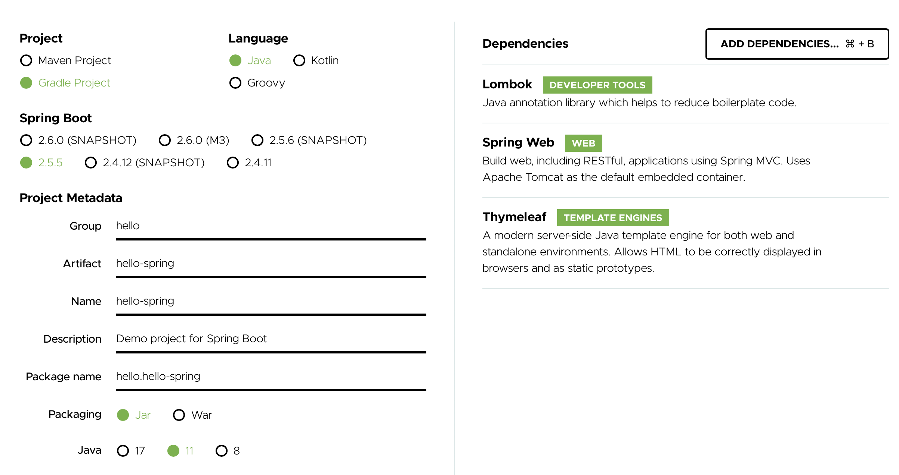
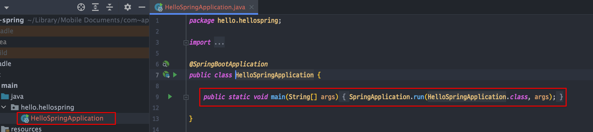
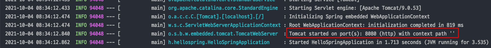
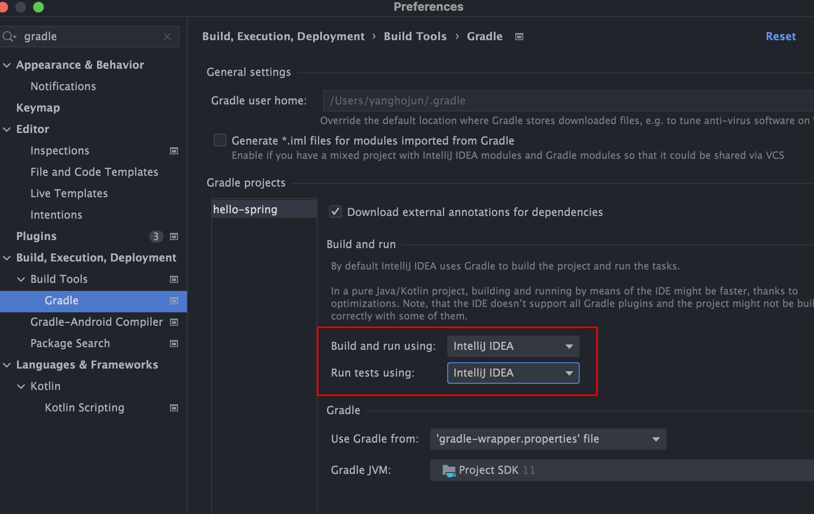

<link href="../../githubCSS/style.css" rel="stylesheet">

# 프로젝트 생성

## 1) 프로젝트 생성

- 프로젝트 생성
- 사전 준비물

  - Java 11 설치
  - IDE: IntelliJ 또는 Eclipse 설치

    > 주의! 가급적 JDK 11 버전을 설치해주세요. 다른 버전을 설치하면 정상 동작하지 않을 가능성이 높습니다.

  - 스프링 부트 스타터 사이트로 이동해서 스프링 프로젝트 생성  
     https://start.spring.io
  - 프로젝트 선택
    - Project: Gradle Project Spring Boot: 2.3.x Language: Java Packaging: Jar
    - Java: 11 Project Metadata
    - groupId: hello
    - artifactId: hello-spring Dependencies: Spring Web, Thymeleaf

## 2) 설명

- Project
  - 거의 추세는 Gradle로 넘어오는 추세
- Language
  - Kotlin
- Springboot

  - M1, Snapshot : 아직 개발중인 버전

- Project 메타 데이터

## 3) 실행

 

- 8080 포트에 tomcat WSA 실행
- 실행 과정
  1. @SpringBootApplication 어노테이션이 붙은 SpringApplication class의 run 메서드를 실행
  2. SpringApplication 하위에 tomcat이 있어서, SpringBoot가 같이 tomcat과 같이 올라옴
  3. 이는 동적으로 띄우는 것! 컴파일이 아님

## 4) 특징

- Gradle 통해 Build가 실행 - Script 처럼
- 위의 설정을 하면 Gradle을 통하지 않고, IntelliJ -> Java 를 통해 빌드가 더 빠를 수 있음
