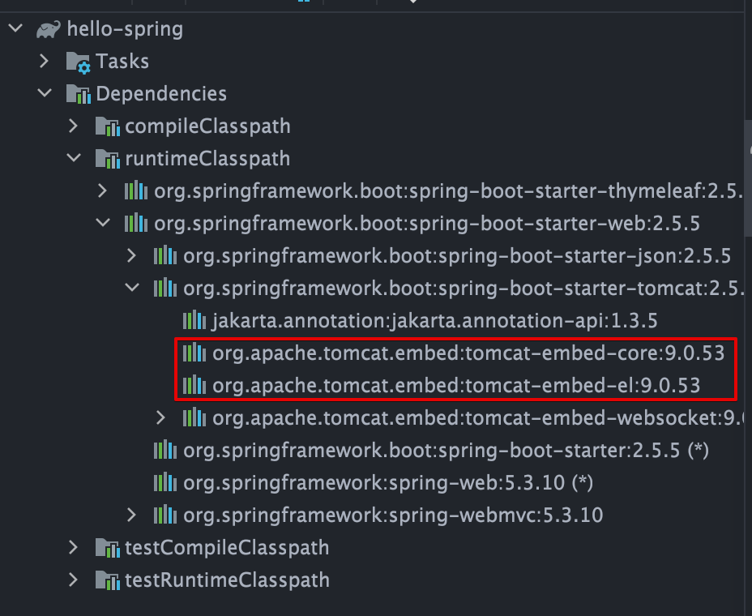

<link href="../../githubCSS/style.css" rel="stylesheet">

# 라이브러리 살펴보기

## 1) 라이브러리

- 라이브러리 살펴보기
  > Gradle은 의존관계가 있는 라이브러리를 함께 다운로드 한다.

> 스프링 부트 라이브러리

- spring-boot-starter-web
  - spring-boot-starter-tomcat: 톰캣 (웹서버)
  - spring-webmvc: 스프링 웹 MVC
- spring-boot-starter-thymeleaf: 타임리프 템플릿 엔진(View)
- spring-boot-starter(공통): 스프링 부트 + 스프링 코어 + 로깅
  - pring-boot
    - spring-core
  - spring-boot-starter-logging - logback, slf4j

> 테스트 라이브러리

- spring-boot-starter-test
  - junit: 테스트 프레임워크
  - mockito: 목 라이브러리
  - assertj: 테스트 코드를 좀 더 편하게 작성하게 도와주는 라이브러리
  - spring-test: 스프링 통합 테스트 지원

### 실제 Gradle에서 포함된 라이브러리 및 추가된 라이브러리

- Gradle에 추가한것 이외, 의존성관리를 알아서 해서 땡겨오는 라이브러리들이 많음
- 추가한 의존관계 하위의 이존관계들이 알아서 땡겨와지는 것

```GRADLE
    plugins {
      id 'org.springframework.boot' version '2.5.5'
      id 'io.spring.dependency-management' version '1.0.11.RELEASE'
      id 'java'
    }

    group = 'hello'
    version = '0.0.1-SNAPSHOT'
    sourceCompatibility = '11'

    configurations {
      compileOnly {
        extendsFrom annotationProcessor
      }
    }

    repositories {
      mavenCentral()
    }

    dependencies {
      implementation 'org.springframework.boot:spring-boot-starter-thymeleaf'
      implementation 'org.springframework.boot:spring-boot-starter-web'
      compileOnly 'org.projectlombok:lombok'
      annotationProcessor 'org.projectlombok:lombok'
      testImplementation 'org.springframework.boot:spring-boot-starter-test'
    }

    test {
      useJUnitPlatform()
    }


```

- Gradle dependency

  
  <br>
  

  - Tomcat이 내장되어있음(dependency를 내장하고 있음 - 웹서버가 자바 안에 포함!) -> **`설정이 매우 편해짐`**
  - 실무에서는 Logging을 써야함 -> **`강의에서는 system.out 쓰고, 따로 공부를 할 것!`**
    - Spring-boot-starter-logging
    - 찾아보기 위해서 다음을 검색할 것(표준화 되었음)
      1. slf4j
      2. logback
  - Java Test 에서는 보통 Junit5로 많이 넘어오는 추세
    - Junit 및 mokito, assertj 등의 dependency가 땡겨와짐
  - Spring Test : 스프링 통합 테스트

