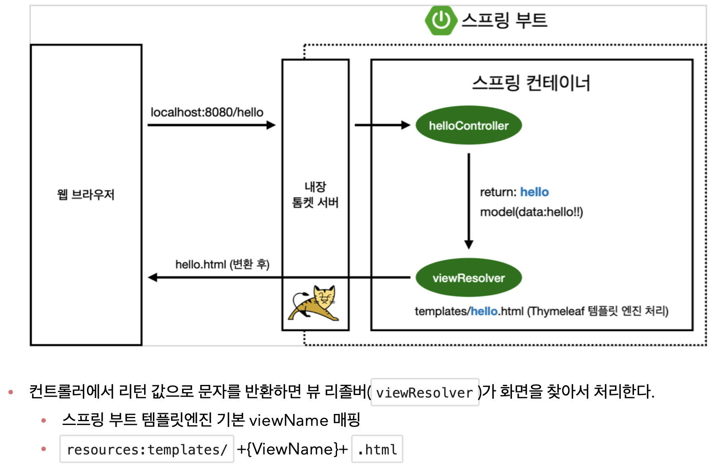
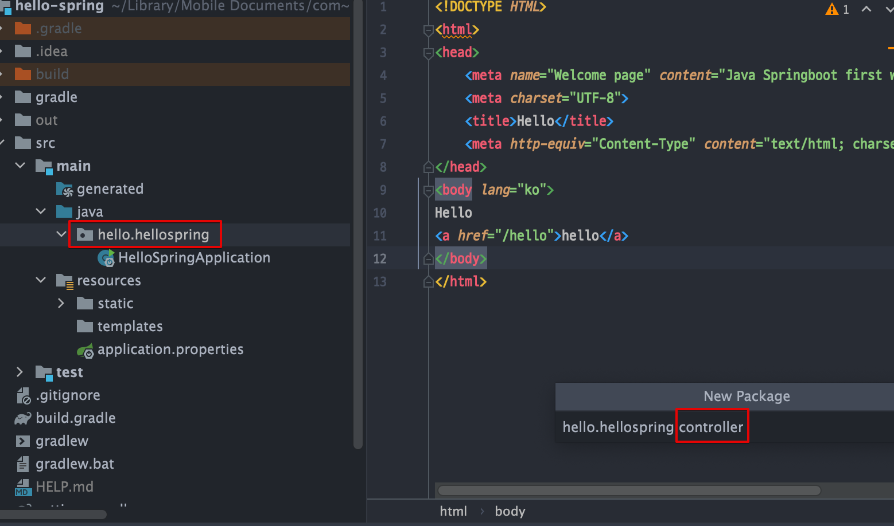

<link href="../../githubCSS/style.css" rel="stylesheet">

# View 파일 설정

## 1) Welcomepage 만들기

- Javacode 이외의 모든 것은 resources 밑에 위치해야 함
  - 여기에서 Static -> index.html 생성

## 2) **`Reference 찾는 능력이 중요!`**

- 스프링 부트가 제공하는 Welcome Page 기능
  - static/index.html 을 올려두면 Welcome page 기능을 제공한다.
  - **`Reference는 spring.io 에서 찾도록 하자(워낙 방대한 Spring이라서, 기본 사용법을 아는 것 외에, 검색 및 적용하는 능력이 중요함`**
    - [https://docs.spring.io/spring-boot/docs/2.3.1.RELEASE/reference/html/spring-boot-features.html#boot-features-spring-mvc-welcome-page](https://docs.spring.io/spring-boot/docs/2.3.1.RELEASE/reference/html/spring-boot-features.html#boot-features-spring-mvc-welcome-page)
  - [**`Static 파일로 제공하는 법`**](https://docs.spring.io/spring-boot/docs/2.3.1.RELEASE/reference/html/spring-boot-features.html#boot-features-spring-mvc-static-content)

> Note : index.html은 정적 웹페이지 그냥 떤져준 것 <br>
> 복잡한 page 제공을 위해(dynamic) Thymeleaf 기능 추가

## 3) Thymeleaf

- thymeleaf 템플릿 엔진
  - thymeleaf 공식 사이트: [https://www.thymeleaf.org/](https://www.thymeleaf.org/)
  - 스프링 공식 튜토리얼: [https://spring.io/guides/gs/serving-web-content/](https://spring.io/guides/gs/serving-web-content/)
  - 스프링부트 메뉴얼: [https://docs.spring.io/spring-boot/docs/2.3.1.RELEASE/reference/html/spring-boot-features.html#boot-features-spring-mvc-template-engines](https://docs.spring.io/spring-boot/docs/2.3.1.RELEASE/reference/html/spring-boot-features.html#boot-features-spring-mvc-template-engines)

## 4) Controller 구현



- 패키지 선 생성

  

- Example

  - HTML

    ```HTML
      <!DOCTYPE HTML>
      <html xmlns:th="http://www.thymeleaf.org">
      <head>
          <title>Hello</title>
          <meta http-equiv="Content-Type" content="text/html; charset=UTF-8" />
      </head>
      <body>
      <p th:text="'안녕하세요. ' + ${data}" >안녕하세요. 손님</p>
      </body>
      </html>
    ```

  - JAVA

    ```JAVA
      @Controller // Model, view, controller의 controller
      public class HelloController {

          @GetMapping("hello") // -> /hello로 들어오면 아래 메서드 실행, GET -> 의 GET 메서드(웹페이지 url 치고 엔터는 get method)
          public String Hello(Model model) {
              // model, view, controller의 model이 이부분
              model.addAttribute("data", "hello"); // data 템플릿 변수에 가서 값을 set 하는 것 (key 값이라고도 함)
              return "hello"; // template 밑에 있는 hello.html을 선택하라는 의미

          }
      }
    ```

---

# 환경 개념 정리

- View 프로그래밍 템플릿 언어가 많은데, 그중에서도 Thymleaf가 3.대로 올라오면서 꽤 사용할만 해짐!
- **`웹 어플리케이션의 처음 진입 지점이 Controller`**
-
