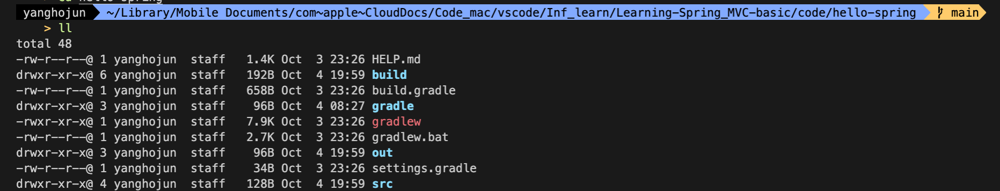
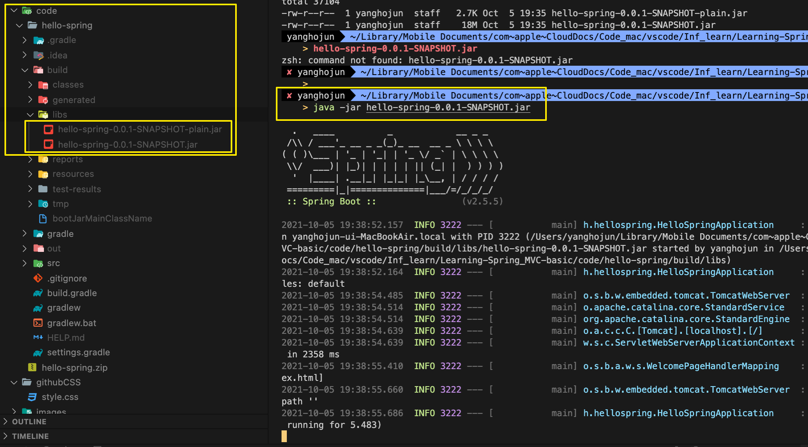

<link href="../../githubCSS/style.css" rel="stylesheet">

# 빌드하고 실행하기

## 1) Source 위치

## 2) 빌드

- `./gradlew build` 명령어로 빌드
  - 빌드에 오류가 나면 `./gradlew clearn` 으로 /build 폴더 모두 제거 가능
  - 혹은 클린 후 빌드 `./gradlew clean build`
- /build 폴더가 생성되고 결과물이 저장됨

## 3) 실행 파일

- /build/libs 하위의 SNAPSHOT 파일을 실행시키면 Spring이 생성되면서 Web Container가 실행됨
- ` -jar \<file name\>` 으로 실행
