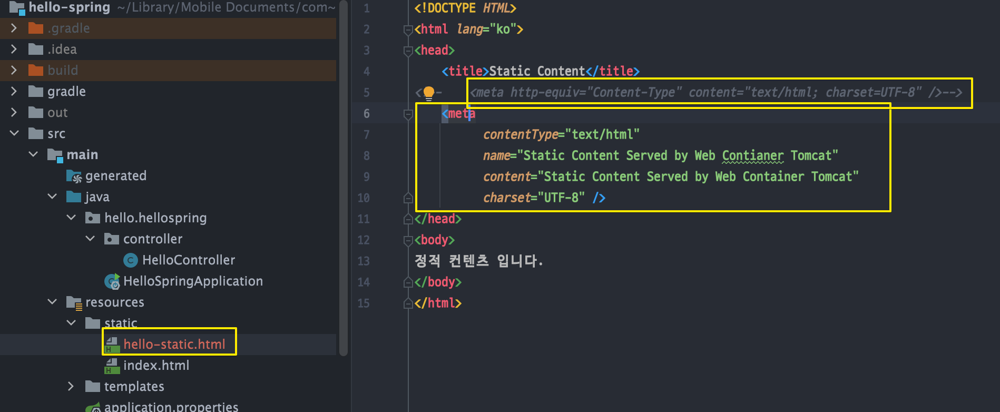
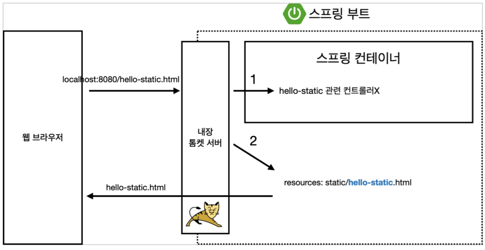

<link href="../../githubCSS/style.css" rel="stylesheet">

# 정적 컨텐츠

> Note : resources의 Static 및 template 폴더 차이
> template : Thymeleaf 전용 파일
> Static : 다른 html, css, JS 파일들
> [참조 링크](https://donghyeon.dev/spring/2019/07/02/스프링부트-static과-template-차이/)

## 1) 종류

- 정적 컨텐츠 : 서버에서 따로 연산 없이 html 및 연관 파일들 바로 제공
- MVC 및 템플릿 엔진 : 가장 많이 사용
  - 서버에서 동적으로 바꿔서 제공하는 것
  - Model, Controller로 제공
- API 제공
  - JSON이란 데이터 포멧으로 데이터를 제공
  - Vue, React 등을 통해 CSR 에서 데이터만 서버에서 가져와서 그려내는 방식
  - 서버끼리 통신할 때(View가 필요없기 때문

## 2) 정적 컨텐츠

 

 

- [내 블로그 글 참조](https://korshika.tistory.com/203)
- 진행 과정
  1. 내장 Tomcat(안의 Apache)
  2. Spring에게 전달
  3. Spring이 hello-static Controller가 있는지 찾아봄
  4. 없음(Mapping된 것이 없음!)
  5. Resources에 있는 hello-static.html 을 직접적으로 반환!
