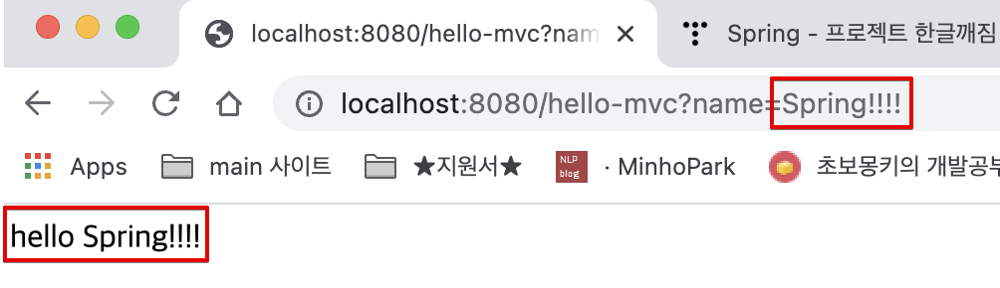

<link href="../../githubCSS/style.css" rel="stylesheet">

# MVC와 템플릿 엔진

- [내 블로그 글 참조](https://korshika.tistory.com/203)

## 1) MVC

- 이전에는 View / Controller가 분리되어있지 않았음
  - JSP 시절 View에다가 모든걸 전부 구현해주었던 때가 있음
  - Model 1 방식이라고도 함
- **`현재 MVC 패턴은 각각 역할과 책임을 최대한 분리하려는 방식`**
  - Controller와 View를 쪼개고, View는 화면만 담당, Controller 로직대로 Model에 필요 데이터 모두 담아 다시 View로 넘겨주는 모델을 많이 사용!

## 2) 예제


<br>

<br>

- GetMapping이기 때문에, url로 입력할 수 있고, queryString 값을 받음
- WAS 에서 Controller는 다음와 같이 구현될 수 있음
- Example

  - Controller - Java
    - @RequestParam을 사용하여, GET/POST 에서 인자를 받을 수 있음, 이때 key값도 지정할 수 있고 필수인지도 지정 가능
    ```JAVA
      @GetMapping("hello-mvc")
      public String HelloMVC(@RequestParam(name="name", required=false) String name, Model model) {
          model.addAttribute("name", name);
          return "hello-template";
      }
    ```
  - HTML

    ```HTML
      <html xmlns:th="http://www.thymeleaf.org">
      <body>
      <!-- hello! empty : 마크업, 디폴트 value, raw text로 보면 나타나는 값을 의미
      차후 서버를 통해 html을 받게 되면, th:text 값으로 해당 부분이 치환됨-->
      <p th:text="'hello ' + ${name}">hello! empty</p>
      </body>

      </html>
    ```

### 처리 과정

1. 주소로 hello-mvc url로 request 들어옴
2. 내장 Tomcat를 통해 스프링 부트를 다시 거쳐감
3. Controller에 매칭되는 것이 있기 때문에 Spring 이 해당 Web Container(매서드) 호출  
   매서드는 다시 Spring에 "hello-template" 및 model key값 (name:spring)을 넘겨줌 -> 여기서 model의 데이터를 가지고 모든 작업을 처리하고 넘겨줌

4. ViewResolver 에서 Thymeleaf 엔진에 의해 생성된 html을 Tomcat에 넘겨줌  
   -> 이때 (3)에서 return된 이름과 동일한 template의 이름을 찾아서 작업, 이것이 rendering이 되어서 변환됨
5. Tomcat이 이를 response로 넘김
6. 이를 Client에서 받아보게 됨

### 결과

  
  <br>
  

-> rendering 되어 default 와 달라진 것을 확인할 수 있음
