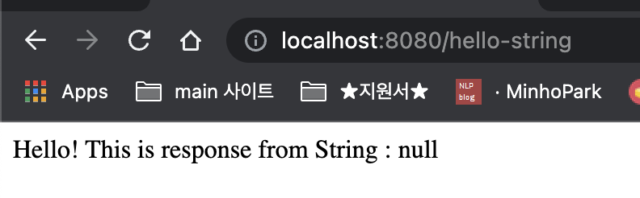
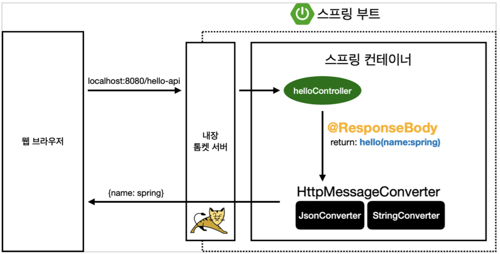

<link href="../../githubCSS/style.css" rel="stylesheet">

# API 방식

- 탬플릿 엔진 rendering 방식과 대비
- 텍스트 형식 및 JSON 등을 받는 식으로 동작

## 1) 예시

- 객체의 instance variable이 이름과 값이 key:value로 변환되어 응답
- Example

  - JAVA

    ```JAVA

      @GetMapping(value = "hello-api")
      @ResponseBody
      public Hello helloApi(@RequestParam(name="name", required = false) String name) {
          return new Hello(name); // 객체가 넘어가게 됨

      }

      static class Hello{ // Static으로 선언하면 load되기 전에 Outer Class에서 먼저 사용할 수 있음

          private String name; // 이부분이 JSON의 값으로 나타남 -> {"name":null}

          public Hello(String name) {
              this.name = name;
          }

          public String getName() {
              return name;
          }

          public void setName(String name) {
              this.name = name;
          }
      }
    ```

  - Result - Terminal

      

## 2) Response Body 사용 API 설명



- 동작 순서

  1. Request 받음
  2. Tomcat이 Spring에게 전달
  3. Spring이 @ResponseBody 를 사용한 것을 확인 -> **`이 시점에서 String으로 변환해서 그대로 response 해야겠다 결정되는 부분(View가 참여하지 않기 때문)`**
     -> // Static / Dynamic에 따라 구분 및 Dynamic일시 viewResolver로 render하는방식 위에서 배움  
     -> 이때, template 검색하고 혹은 static하게 파일을 access하면 정적으로 응답  
     -> 이 경우는 객체를 응답

     - HTTP의 BODY에 문자 내용을 직접 반환
     - **`viewResolver 대신에 "HttpMessageConverter" 가 동작 [@ResponseBody 에서 동작]`** //Spring에서 다 자동으로 해줌
       - 기본 문자처리: StringHttpMessageConverter -> String일 때 동작
       - 기본 객체처리: MappingJackson2HttpMessageConverter -> 객체일 때 동작(스프링 기본 라이브러리 Jackson)
       - byte 처리 등등 기타 여러 HttpMessageConverter가 기본으로 등록되어 있음

  4. 다시 request 한 곳에 반환 // Another Server, Android, WebBrowser.... ect

- 참고
  - 클라이언트의 HTTP Accept 해더와 서버의 컨트롤러 반환 타입 정보 둘을 조합해서 HttpMessageConverter 가 선택됨
    - Accept 헤더에는 받고싶은 타입을 지정해서 보낼 수 있는 것
    - **`여튼 결론은 거의 최근에는 Json이 완전 대세`**
  - 더 자세한 내용은 스프링 MVC 강의에서 설명
