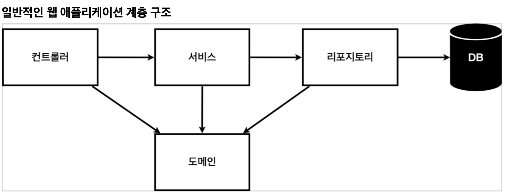
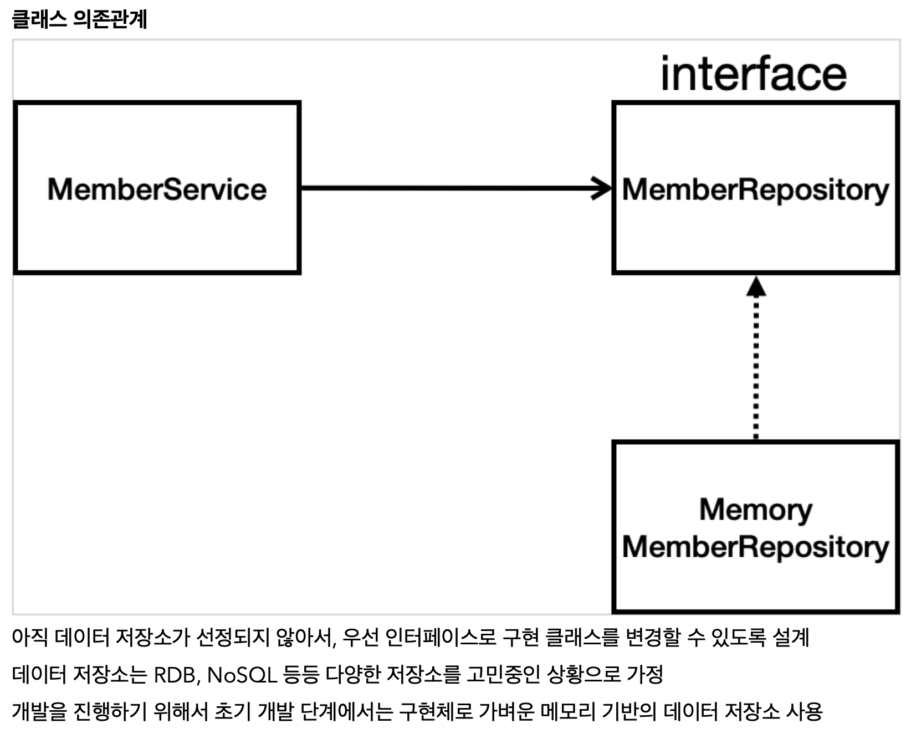
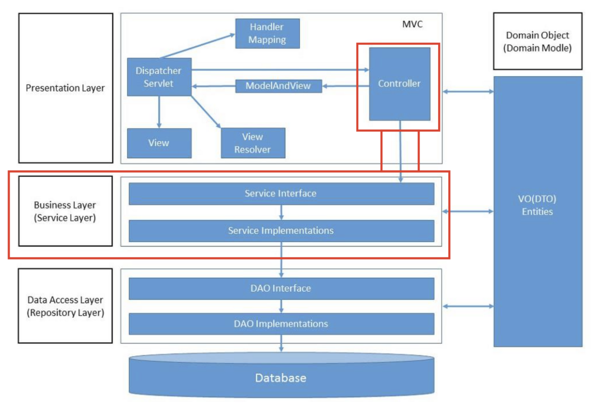
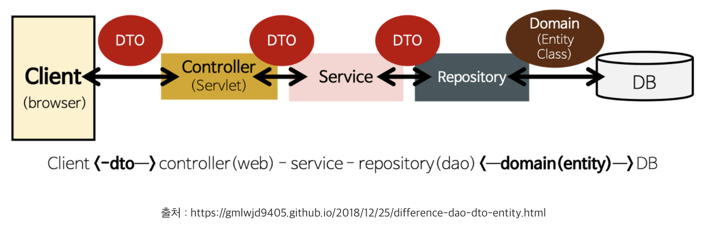
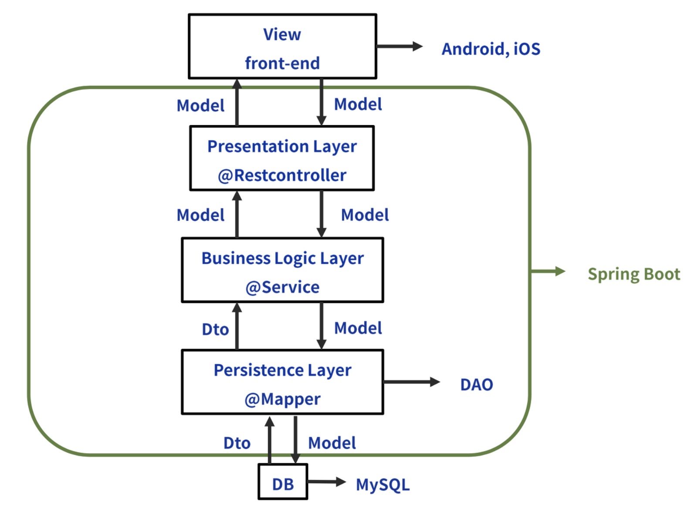

<link href="../../githubCSS/style.css" rel="stylesheet">

# 비지니스 요구사항 분석

- 절차
  - 비즈니스 요구사항 정리
  - 회원 도메인과 리포지토리 만들기
  - 회원 리포지토리 테스트 케이스 작성
  - 회원 서비스 개발
  - 회원 서비스 테스트

## 1) 요구사항 정리

- 요구조건( 공부용이므로 간단한것으로 구현해보기 ); **더 자세한 내용은 활용1편 공부하기**
  1. 데이터 : 회원ID, 이름
  2. 기능 : 회원 등록, 조회
  3. 아직 데이터 저장소가(서버) 선정되지 않음 - 가상 시나리오(일단 메모리로 구현, 인터페이스 사용)

 

 

- 특징

  - MVC랑 부분적으로 겹침
  - [내글 참조](https://korshika.tistory.com/202)
  - [웹 애플리케이션과 MVC 참조](https://m.blog.naver.com/jwyoon25/221322091101)

- 설명

---

### Spring 계층구조

   

- 특징
  - MVC 패턴은 Servlet 안에서의 국한된 Pattern임
- 참조 사이트
  - [참조 링크](https://devlog-wjdrbs96.tistory.com/209)

 

1. 계층 구조 종류

   1. Presentation Layer (MVC)
   2. Business(Service) Layer
   3. Data Access(Repository) Layer
   4. Domain(Entity) Layer

2. 설명

   1. Presentation Layer( MVC 적용 부분 )

      - 브라우저상의 웹 클라이언트의 요청 및 응답을 처리
      - 서비스계층, 데이터 엑세스 계층에서 발생하는 Exception을 처리
      - @Controller 어노테이션을 사용하여 작성된 Controller 클래스가 이 계층에 속함

   2. Business(Service) Layer

      - 애플리케이션 비즈니스 로직 처리와 비즈니스와 관련된 도메인 모델의 적합성 검증
      - 트랜잭션 관리
      - 프레젠테이션 계층과 데이터 엑세스 계층 사이를 연결하는 역할로서 두 계층이 직접적으로 통신하지 않게 함
      - Service 인터페이스와 @Service 어노테이션을 사용하여 작성된 Service 구현 클래스가 이 계층에 속함

   3. Data Access(Repository) Layer

      - ORM (Mybatis, Hibernate)를 주로 사용하는 계층
      - DAO 인터페이스와 @Repository 어노테이션을 사용하여 작성된 DAO 구현 클래스가 이 계층에 속함
      - Dabase에 data를 CRUD(Create, Read, Update, Drop)하는 계층

   4. Domain(Entity) Layer
      - DB의 테이블과 매칭될 클래스
      - Entity 클래스라고도 부른다.

3. 공통 용어 정리

   1. DTO(Data Tranfer Object)

      - 각 계층간 데이터 교환을 위한 객체 (데이터를 주고 받을 포맷)
      - Domain, VO라고도 부름
      - DB에서 데이터를 얻어 Service, Controller 등으로 보낼 때 사용함
      - 로직을 갖지 않고 순수하게 getter, setter 메소드를 가진다.
      - Entity 클래스란?
        - Domain 이라고도 부름 (JPA 사용할 때 사용)
        - 실제 DB 테이블과 매칭될 클래스
        - Entity 클래스 또는 가장 Core한 클래스라고 부름
        - Domain 로직만을 가지고 있어야하며 Presentation Logic을 가지고 있어서는 안된다.

   2. DAO(Data Access Object)

      - DB에 접근하는 객체, DB를 사용해 데이터를 조작하는 기능을 하는 객체 (MyBatis 사용시에 DAO or Mapper 사용)
      - Repository라고도 부름(JPA 사용시 Repository 사용)
      - Service 계층과 DB를 연결하는 고리 역할을 한다.

   3. Domain 클래스와 DTO 클래스를 분리하는 이유
      - View Layer와 DB Layer의 역할을 철저하게 분리하기 위해서
      - 테이블과 매핑되는 Entity 클래스가 변경되면 여러 클래스에 영향을 끼치게 되지만 View와 통신하는 DTO 클래스는 자주 변경되므로 분리해야 한다.
      - 즉 DTO는 Domain Model을 복사한 형태로, 다양한 Presentation Logic을 추가한 정도로 사용하며 Domain Model 객체는 Persistent만을 위해서 사용한다.

4. 그림 예시

   
    
   
    

---
