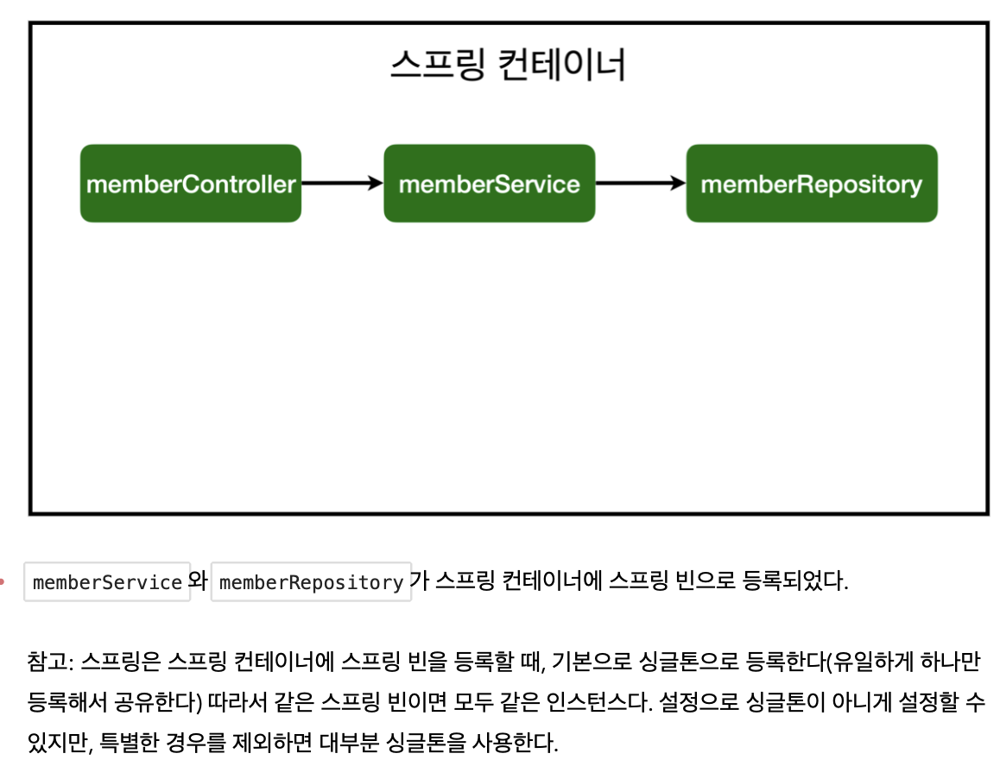

<link href="../../githubCSS/style.css" rel="stylesheet">

# 컴포넌트 스캔과 자동 의존관계 등록

- 서비스를 Controller가 의존해야함
- Spring에 맞는 방식이 있음

## 1) 구현

1. @Controller로 스프링 빈 등록

    

   - 내장 톰캣보다 밑단에서 불러와서 사용

 

2. 다른 부분에 Bean 등록

   - Controller / Service / Repository 의 layer 패턴대로 설정해주는 것

     - 담당 역할

       1. Controller : 외부 요청 수용
       2. Service : 비지니스 로직을 구현
       3. Repository : 데이터 저장

   - [Layer별 설정은 Ch4 - (1) 참고](<"..//..//..//Ch4%20-%20회원관리%20예제(백엔드%20개발)//(1)%20비지니스%20요구사항%20분석%20&%20Spring%20계층%20구조.md">)

   - MVC는 이 layer들 보다 위에 있음

      
       
      
       
      
       

## 2) 등록 과정

- 최종적으로 layer들을 서로 이어주면 다음과 같은 결과가 나옴

    

## 3) 등록 방법

1. Component Scann / 자동 의존관계 주임(DI)
   - **`위 과정에서 layer용 @ Annotation 안에 Component 어노테이션이 모두 포함되어있음`**
2. Vanilla Java 코드로 등록하기

## 4) 자동 인식의 기준

- HelloSpringApplication 을 최상단으로, 이 패키지 하위를 모드 스캔하는 것
- @ComponentScan에서 설정해주면 됨

## 5) 싱글톤 등록

- 기본으로 모든 컨테이너들이 모드 "같은 인스턴스"를 생성하여 반환
  - 메모리 등이 이유로 최적화 하는것
- LifeCylce을 따로 설정할 수 있음(SpringBoot-강좌에서 모두 다루었음)
