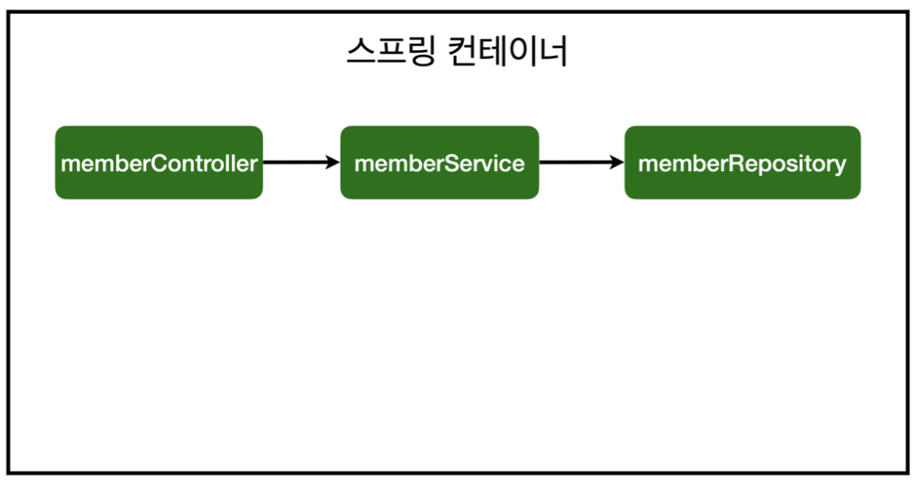
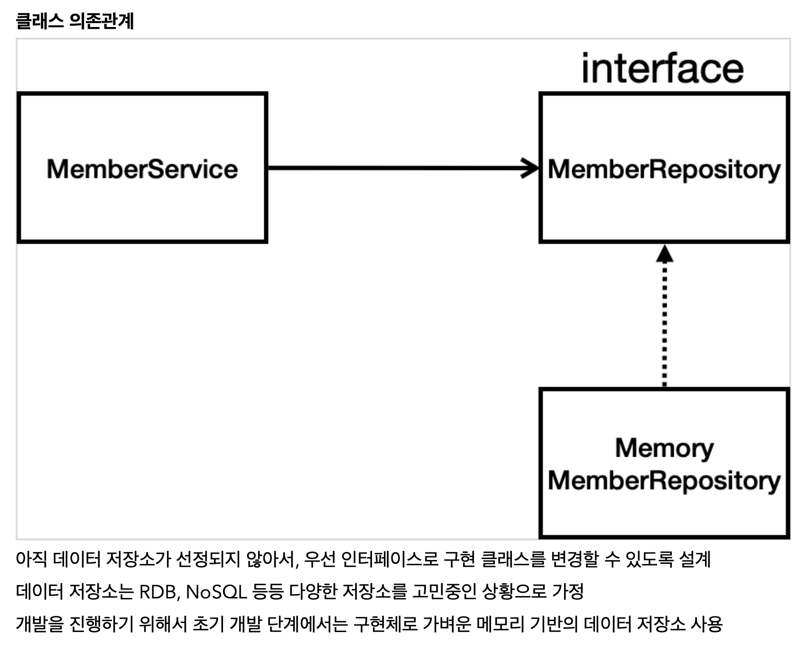
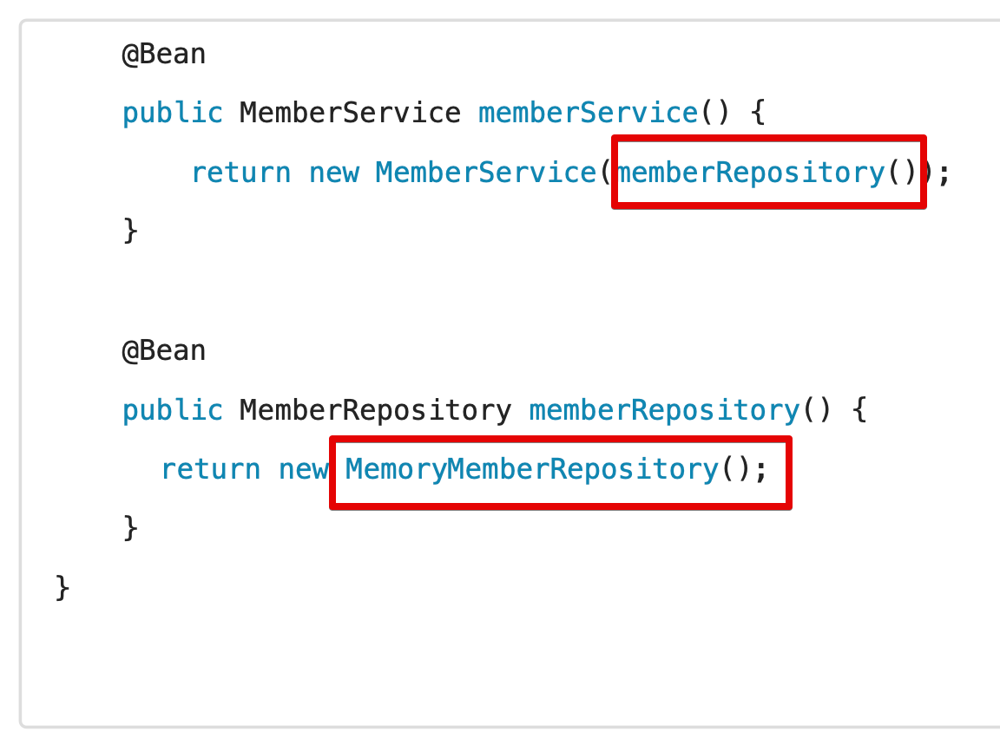

<link href="../../githubCSS/style.css" rel="stylesheet">

# 자바 코드로 직접 스프링 등록하기

- 하나하나 직접 Spring에 등록하기
- 주입을 수동으로 하는 것
  - Bean / Configuration 등록
    - 어노테이션은 여전히 사용하지만 수동등록인 점이 다름

## 1) Java로 수동 주입 예시

- JAVA

  ```JAVA
    package hello.hellospring;

    import hello.hellospring.repository.MemberRepository;
    import hello.hellospring.repository.MemoryMemberRepository;
    import hello.hellospring.service.MemberService;
    import org.springframework.context.annotation.Bean;
    import org.springframework.context.annotation.Configuration;
    import org.springframework.stereotype.Service;

    @Configuration
    public class SpringConfig {

        @Bean
        public MemberService memberService() {
            return new MemberService(memberRepository());
        }

        @Bean
        public MemberRepository memberRepository() {
            return new MemoryMemberRepository();
        }
    }

  ```

- Result - Terminal

    

  - 정상동작하게 됨

## 2) 주입 방법 선택

- 주입 방식
  1. 생성자 주입 : **`생성 시점에 조립하고, 동적인 실수 및 변경등을 아예 차단할 수 있음`**
  2. 필드 주입 : setter 호출을 하기 때문에, Spring에 의존적임(Autowired를 구현체 필드 영역에 붙여줌)
  3. setter 주입 : public으로 열려있기 때문에, 잘못 건드려질 수 있어서 권장되지는 않음

참고: XML로 설정하는 방식도 있지만 최근에는 잘 사용하지 않으므로 생략한다.

> 참고: DI에는 필드 주입, setter 주입, 생성자 주입 이렇게 3가지 방법이 있다. 의존관계가 실행중에 동적으로 변하는 경우는 거의 없으므로 생성자 주입을 권장한다.  
> 참고: 실무에서는 주로 **`정형화된 컨트롤러, 서비스, 리포지토리 같은 코드는 컴포넌트 스캔을 사용`** 한다. 그리고 정형화 되지 않거나, **`상황에 따라 구현 클래스를 변경해야 하면 설정을 통해 스프링 빈으로 등록한다.`**
>
> - 아직 구현이 되지 않은 서비스같은 경우, 수동 등록 등을 사용할 수 있다
> - **`기존 코드에 일절 손을 대는 경우가 없이 "아직 결정되지 않은 것에 대해서 대응하는 시나리오"를 서포트 할 수 있음 `**

- 구현체 바꿔치는 시나리오를 수동 등록으로 할때의 클래스 다이어그램

    
    <br>
    
    <br>

  - 위의 상황에서, 구현체를 생성해주는 Bean의 리턴만 갈아끼워주면 되기 때문
    - **`내 수동 등록 빈을 번외로 추가할 줄 알아야 함!`**
  - 자동 생성자 주입은, 직접 구현체 코드로 가서 Autowired / Component 스캔 들어간 Annotation다 지워줘야 하므로 번거로울 수 있음

## 3) 빈의 등록이 필요한 이유

- Autowired 등이 적용되려면, 수동 등록의 Bean이 상위에서 반드시 실행되어야 함
- Example

  - JAVA

    ```JAVA
      // 주석처리 해버린 경우

      //@Configuration
      //public class SpringConfig {
      //
      //    @Bean
      //    public MemberService memberService() {
      //        return new MemberService(memberRepository());
      //    }
      //
      //    @Bean
      //    public MemberRepository memberRepository() {
      //        return new MemoryMemberRepository();
      //    }
      //}

      ...

      // @Component
      @Service // @Component에서 서비스로 변경
      @RequiredArgsConstructor
      public class MemberService { // 위에서 주석처리 해버리면, 이부분 밑에 Autowired 동작이 안됨(자동으로 붙는 경우임 이 경우는)

          private final MemberRepository memberRepository;


          public Long join(Member member) {
    ```
