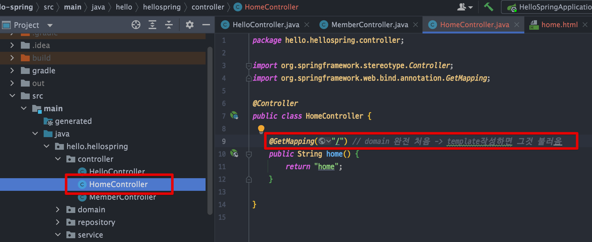
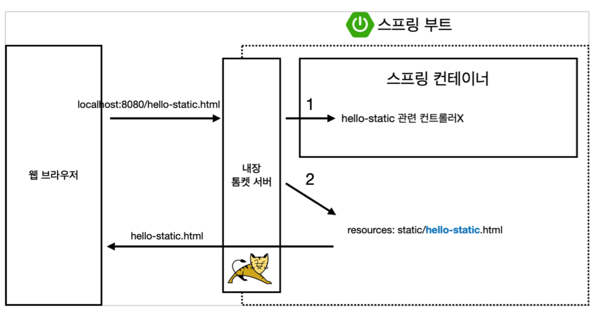

<link href="../../githubCSS/style.css" rel="stylesheet">

# 회원 웹 기능 - 홈화면 추가

## 1) home 화면 추가

 

 

- 홈 화면이 template으로, Static 보다 우선
- 내장 tomcat이 Template 부터 확인하도록 됨
  - 따라서, 처음 생성한 index를 확인하지 않고, template을 먼저 사용함
