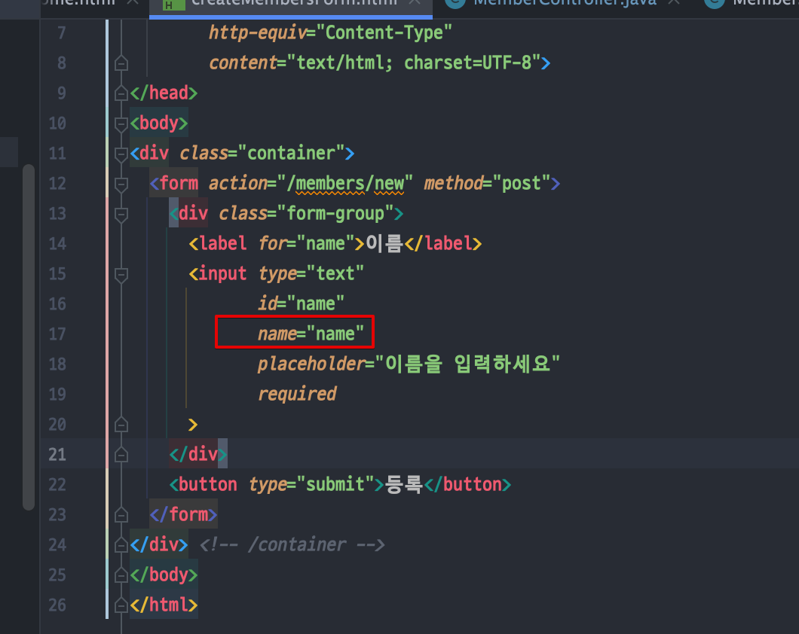
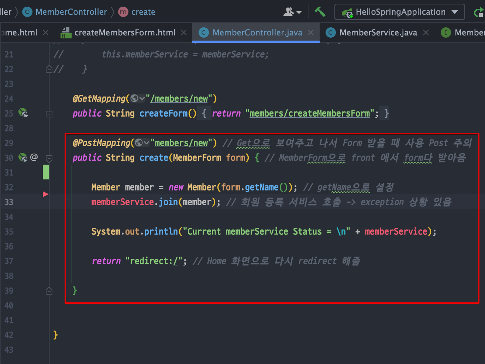

<link href="../../githubCSS/style.css" rel="stylesheet">

# 회원 웹 기능 - 등록

> GET : url에서 유저 인풋이 들어오는 것
> POST : 특정 데이터와 함께, body에 데이터 넣어서 전송하는 것

## 1) MemberController

- JAVA

  ```JAVA

    @Controller // @Bean @Component 마냥, Spring이 넣어두고 관리하게 되는 대상으로 처음 시작때 등록
    @RequiredArgsConstructor // private 붙은 것에 생성자 주입 자동으로 관리
    public class MemberController {

        private final MemberService memberService;

    /* 밑에와 같이 생성자 주입 사용하여도 됨*/
    //    @Autowired // 한개짜리면 없어도 자동으로 연결
    //    public MemberController(MemberService memberService) {
    //        this.memberService = memberService;
    //    }

        @GetMapping("/members/new")
        public String createForm() {
            return "members/createMembersForm";
        }

        @PostMapping("members/new") // Get으로 보여주고 나서 Form 받을 때 사용 Post 주의
        public String create(MemberForm form) { // MemberForm으로 front 에서 form다 받아옴
            Member member = new Member(form.getName()); // getName으로 설정

            memberService.join(member); // 회원 등록 서비스 호출 -> exception 상황 있음

            return "redirect:/"; // Home 화면으로 다시 redirect 해줌

        }


    }
  ```

## 2) 동작 원리

1. 프론트 페이지에서 /members/new로 타고 들어감
2. 다음의 부분이 Template에서 렌더링 되고, tomcat에 의해 뿌려진다

   - 이때, key 값을 name 이라고 해놓은 상태에서, Form을 받아오는 부분을 구현하여 vlaue까지 받아오도록 한다
   - method : Post로 해놓았기 때문에, Form받는 부분에서 PostMapping으로 받아야 한다

   
   <br>
   
   <br>
