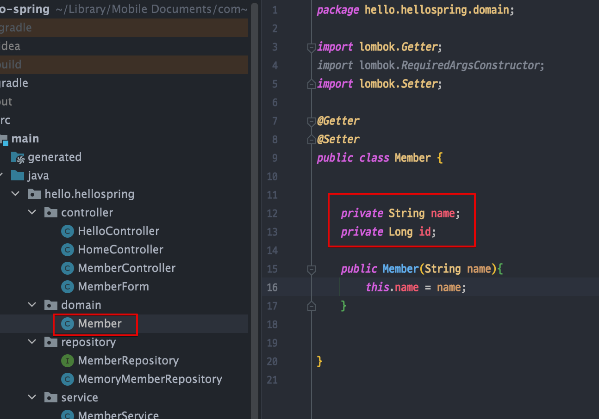
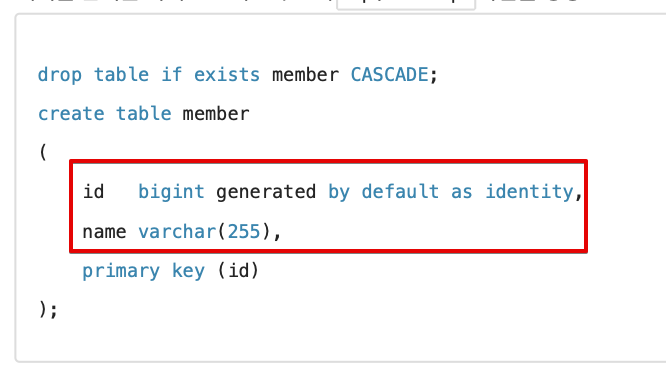

<link href="../../githubCSS/style.css" rel="stylesheet">

# H2 데이터베이스 설치

- 이유 : 메모리에 올리는 것이 아니라, 보조 기억장치에 올려놓고 쓰기 위함
- 데이터의 관리도 가능, 접근 제한 등의 설정도 할 수 있음

## 1) H2 데이터베이스 설치

- 개발이나 테스트 용도로 가볍고 편리한 DB, 웹 화면 제공
- https://www.h2database.com
- 다운로드 및 설치
  - h2 데이터베이스 버전은 스프링 부트 버전에 맞춘다.
  - 권한 주기: chmod 755 h2.sh (윈도우 사용자는 x)
  - 실행: ./h2.sh (윈도우 사용자는 h2.bat)
  - **`brew install h2 : MacOS에서 편하게 설치 가능`**
- 데이터베이스 파일 생성 방법
  - jdbc:h2:~/test (최초 한번)
  - ~/test.mv.db 파일 생성 확인
  - 이후부터는 jdbc:h2:tcp://localhost/~/test 이렇게 접속
- **`실행은 homebrew로 한 경우, 터미널에서 h2로 실행`**

## 2) H2 데이터베스 연결

- 연결 : 다음 위치에 진행
  - jdbc:h2:tcp://localhost/~/Users/yanghojun/Library/Mobile Documents/com~apple~CloudDocs/Code_mac/vscode/Inf_learn/Learning-Spring_MVC-basic/code/db
  - 진행 안됨 -> 그냥 원래 위치를 사용

## 3) Spring과의 Mapping

 

 

- id bigint generated by default as identity : 비어서 들어오면, 자동으로 채우도록 하는 명령어
- PK : id로 잡아놓음