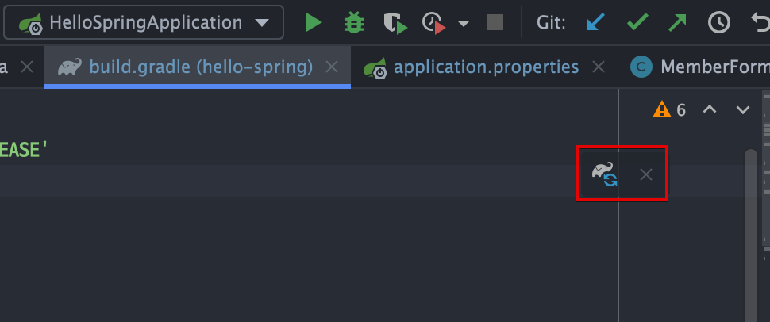
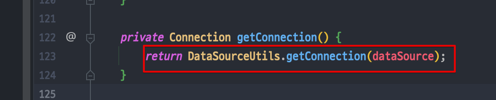
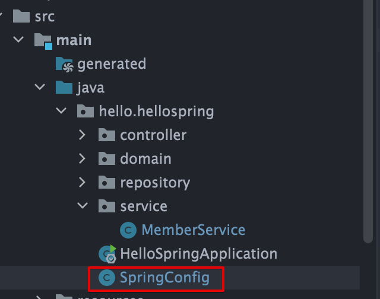

<link href="../../githubCSS/style.css" rel="stylesheet">

# 순수 JDBC - 지옥

- 고대에 쓰던 방식은 지옥(참고만 하기~)

## 1) Build.gradle 수정

- build.gradle 에 다음 추가
  ```gradle
    implementation 'org.springframework.boot:spring-boot-starter-jdbc'
    runtimeOnly 'com.h2database:h2'
  ```
- 다음을 resources에 추가

  - 위치 : main/resources/application.properties

    ```text
      spring.datasource.url=jdbc:h2:tcp://localhost/~/test
      spring.datasource.driver-class-name=org.h2.Driver
      spring.datasource.username=sa  # 유저 이름은 안넣어도 됨!

    ```

  - 주의 사항
    > 스프링부트 2.4부터는 spring.datasource.username=sa 를 꼭 추가해주어야 한다.  
    > 그렇지 않으면 Wrong user name or password 오류가 발생한다. 참고로 다음과 같이 마지막에 공백이 들어가면 같은 오류가 발생한다.  
    > spring.datasource.username=sa 공백 주의, 공백은 모두 제거해야 한다.

## 2) Gradle 파일 refresh


<br>

## 3-1) JDBC 연결 - Repository별 순수 JAVA 구현

- 굉장히 복잡한 경우가 있음
- 리소스 연결 / 작업 / 반납의 일련의 과정들을 모두 구현
- DB connection은 다음의 Spring framework의 힘을 빌리는 게 좋음

    
    <br>

  - 커넥션은 transaction 단위로 연결을 계속 유지시켜주는 기능이 있음

---

## 4) **`MemoryMemberRepository / JdbcMemberRepository 전환하기`**

- Spring Config 다음과 같이 설정하기
- Example

  - 특징

    1. SpringConfig에 추가 설정을 하면 알아서 읽어들이도록 됨
       <br>
       
       <br>
    2. 멤버관련 서비스도 따로 빼줘야하기 때문에, memberService 단에서 생성자 주입코드 없애주고 수동으로 등록해줘야 함
    3. **`Ch5 - 2 에서도 다뤘지만, 이는 큰 장점이 있음; 코드를 손대지 않고 Configuration만 바꿔줘도 됨(클래스 다이어그램의 수정)`**
    4. 당연하지만, **`DB Server가 켜져있어야 동작한다`**

  - JAVA

    ```JAVA

      @Configuration
      public class SpringConfig {

          private DataSource dataSource; // 데이터소스 Spring에서 생성 이후, Autowired로 주입
          // Autowired로 주입할 수 있는 이유는, @Configuration 자체도 스프링에서 관리하는 것이므로
          // Cascading 형태로 관리를 내려가면서 해주는 형식이기 때문에 가능한듯

          @Autowired
          public SpringConfig(DataSource dataSource) {
              this.dataSource = dataSource;
          }

          @Bean
          public MemberService memberService() {
              return new MemberService(memberRepository());
          }

          @Bean
          public MemberRepository memberRepository() {
      //        return new MemoryMemberRepository();


              return new JdbcMemberRepository(dataSource);
          }
      }
    ```

---

## 5) Spring의 장점

- **`(4)에서 확인한 것과 같이, 수동등록으로 바로 구현체를 주입해줄 수 있는 것이 최대 장점`**
- 개방-폐쇄 원칙(OCP, Open-Closed Principle)
  - 확장에는 열려있고, 수정, 변경에는 닫혀있다.
  - 스프링의 DI (Dependencies Injection)을 사용하면 기존 코드를 전혀 손대지 않고, 설정만으로 구현 클래스를 변경할 수 있다.
    - 단, 조립하는 코드만 수정, 실제 구현 코드들은 손댈 필요가 없음!
