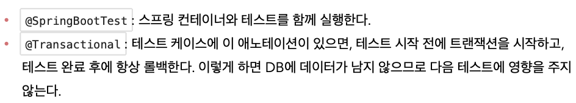

<link href="../../githubCSS/style.css" rel="stylesheet">

# 스프링 통합 테스트

- DB까지 연결한 후, 테스트 작성하여 모든 부분을 테스트하는 것
- 실제로 이렇게 테스트를 당연히 해야 함!
- **`DB같은 경우에, 모두 스프링 상에서 등록한 이후 동작하는데, 이에대한 테스트를 수행하기 위해 스프링 테스트 환경을 구성해주어야 테스트를 진행할 수 있음`**

## 1) DB 테스트

- 보통 운영 DB 말고, 테스트용 지정 DB를 사용하거나 local에 있는 데이터 사용하여 검증
- Test Code

  - JAVA

    ```JAVA
      /*
      * 스프링에게 직접 전달받아서 테스트 구성하는 방법
      * */
      @SpringBootTest
      @Transactional
      @RequiredArgsConstructor
      class MemberServiceIntegrationTest {

          // 변수 주입 -> JUnit 특성 때문에 rombok으로는 주입할 수 없음(JUnit이 DI 먼저 개입)
          @Autowired MemberService memberService;
          @Autowired MemberRepository memberRepository;


      //    @SpringBootTest 를 통해 주입을 스프링에서 하도록 세팅을 하기 때문에, 직접 객체 생성하여 주입하지 않아도 됨
      //    @BeforeEach
      //    void beforeEach() {
      //        memoryMemberRepository = new MemoryMemberRepository();
      //        memberService = new MemberService(memoryMemberRepository); // 분리해서 clear 가능하도록 구현
      //    }

      //    @Transactional로 인하여, 자동으로 release되도록 설정
      //    @AfterEach
      //    void afterEach() {
      //        memoryMemberRepository.storeClear(); // 테스트환경 보장
      //    }


          @Test
          @DisplayName("정상상태 Join")
          void join1() {
              //given
              Member member1 = new Member("Member 1");

              //when
              Long returnID = memberService.join(member1);

              //then
              memberService.findOne(returnID).map(Member::getId)
                      .ifPresent(aLong -> Assertions.assertEquals(aLong, returnID));
              memberService.findOne(returnID).map(Member::getName)
                      .ifPresent(nString -> Assertions.assertEquals(nString, member1.getName()));

          }

          @Test
          @DisplayName("오류상태 Join - 중복회원 이름 검출 검증")
          void join2() {

              // given
              Member memberD1 = new Member("Dummy1");
              Member memberD2 = new Member("Dummy1");

              // when
              memberService.join(memberD1);


              // then
              IllegalStateException illegalStateException = assertThrows(IllegalStateException.class, () -> {
                  memberService.join(memberD2);
              });
              org.assertj.core.api.Assertions.assertThat(illegalStateException.getMessage()).isEqualTo("이미 존재하는 회원 이름입니다.");

          }

      }
    ```

  - Result - Terminal

    - **`테스트 수행시`** : @Transactional 때문에 테스트 반복수행을 할 수 있음; DB에 commit까지는 안된다는 의미
      - @Test 위에 @Commit 붙이면 실제로 Commit하게 됨
      - **`순수 자바코드로 구현하는 단위 테스트가 더 좋음; 빠른 테스트(갯수 많을수록), 통합테스트는 DB 체크할 때 쓰자!`**
    - Insert Query 이후 Commit을 해야하는데, 기본은 AutoCommit이지만, Spring에서 모드를 AutoCommit으로 하지 않고  
      RollBack을 하게되므로, 해당 테스트의 데이터가 추가되지 않음
    - 트랜잭션 ~ 롤백 사이의 작업들은 모두 잘 수행됨(Join 등의 매서드를 잘 이용하였으므로)
    - **`즉, 자동 롤백이 됨, 테스트에 매우 유용`**

    
