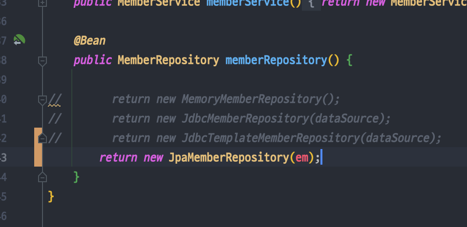
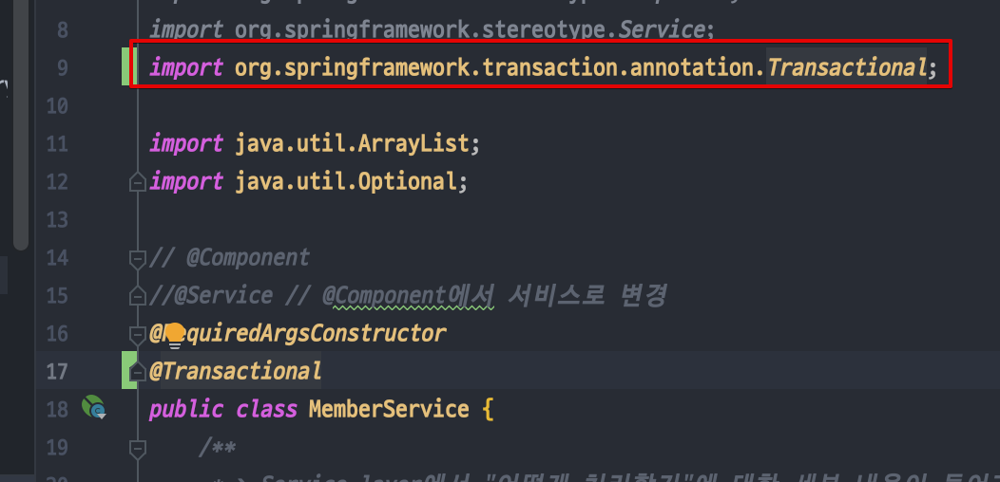

<link href="../../githubCSS/style.css" rel="stylesheet">

# JPA migration

- SQL 쿼리도 자동으로 처리해주는 library
- Memory에 Member를 추가하는 MemoryMemberRepository 와 비슷
  - JPA에 멤버를 추가하는 것; 이 부분이 알아서 DB와의 동작을 알아서 구현
  - **`객체중심의 설계로 패러다임을 전환할 수 있음`**
  - JPA; Java Persistency API + Maibatis(프레임워크); 이 두개를 묶어서 잘 사용

## 1) 적용 방법

1. Application에 관리 추가

   - JAVA

     ```JAVA
       // application.properties
       spring.datasource.url=jdbc:h2:/Users/yanghojun/Library/Mobile Documents/com~apple~CloudDocs/Code_mac/vscode/Inf_learn/Learning-Spring_MVC-basic/code/db
       spring.datasource.driver-class-name=org.h2.Driver
       spring.datasource.username=sa

       #나중에 sql문은 jpa에서 볼 수 있게 해줌
       spring.jpa.show-sql=true
       #jpa는 원래 객체를 보고 테이블까지 생성, 예제 학습을 위해서 끄고 시작 ( create table )
       spring.jpa.hibernate.ddl-auto=none
     ```

2. JPA dependency Gradle에 추가

   - JAVA
     ```JAVA
      // DB 연결위한 부분
      // implementation 'org.springframework.boot:spring-boot-starter-jdbc' // jpa 위해서 지움 -> 내부에 jdbc 라이브러리 포함
      implementation 'org.springframework.boot:spring-boot-starter-data-jpa' // jpa용 dependency 추가
      runtimeOnly 'com.h2database:h2'
     ```

3. Member Domain을 JPA에 관리하도록 어노테이션 추가

   - JAVA

     ```JAVA
       @Getter
       @Setter
       @Entity // JPA가 관리한다!  -> 이 어노테이션 추가!
       public class Member {

           @Id @GeneratedValue(strategy = GenerationType.IDENTITY) // PK 값의 관리, 채우는 값을 DB가 알아서 생성해주는 것이 Identity 전략
           private Long id;
           //@Column(name = "NAME") -> 만약 column 이름이 name이 아닌 경우, 옆에처럼 명시해주면 됨
           private String name;

           public Member() {
           }

           public Member(String name){
               this.name = name;
           }


       }
     ```

4. MemberRepository 구현체 작성

   - 특징
     - 단건 조회에 대해서는 jpql 작성이 필요없으나, 여러개가 return되는 경우 필요할 수 있음( or PK 기반이 아닌 경우 )
     - 이 jpqa문도 나중에는 다른 방식으로 객체화 시킬 수 있음; **`data JPA 사용시`**
   - JAVA

     ```JAVA

       @Component
       @RequiredArgsConstructor
       public class JpaMemberRepository implements MemberRepository {

           private final EntityManager em; // JPA에서는 모든 DB 정보를 옆의 객체로 주입받음(SpringBoot가 알아서 관리하게 됨)

       //    public JpaMemberRepository(EntityManager em) {
       //        this.em = em;
       //    }

           @Override
           public Member save(Member member) {
               em.persist(member); // JPA ; Insert 수행
               return member;
           }

           @Override
           public Optional<Member> findByID(Long id) {
               Member member = em.find(Member.class, id);
               return Optional.ofNullable(member);
           }

           @Override
           public Optional<Member> findByName(String name) {
               List<Member> memberList = em.createQuery("select m from Member m where m.name= :name", Member.class)
                       .setParameter("name",name)
                       .getResultList();
               return memberList.stream().findAny();
           }

           @Override
           public ArrayList<Member> findAll() {
               // JPQL : 테이블 대상으로 query를 날리는 것이 아닌, 객체 대상의 JAP sql 유사 문법
               return (ArrayList<Member>) em.createQuery("select m from Member m", Member.class).getResultList();
           }
       }

     ```

5. Spring Config 수정 & 서비스or회원가입에 Transaction 추가

   - Transaction에 대해서만 JPA가 동작하므로

   
   <br>
   
   <br>
