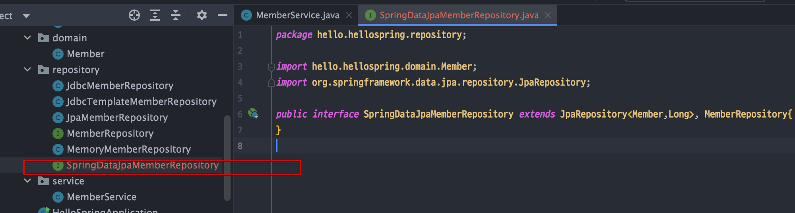

<link href="../../githubCSS/style.css" rel="stylesheet">

# 스프링 데이터 JPA

- 인터페이스 만으로 모든 개발을 할 수 있도록 해줌
- 개발자가 핵심 비지니스 로직을 구현하는데 집중할 수 있음!
- 주의
  - JPA 학습을 먼저 하고, spring-data JPA를 사용해야 함! -> 이는 편리성을 도와주는 것일 뿐임
  - **`JPA 원리를 먼저 알고 작업해야 함!`**

## 1) 적용

- 인터페이스 사용

  - 특징
    - Spring-Data JPA가 interface **`SpringDataJpaMemberRepository`** 를 보고, 자동으로 스프링 빈에 등록을 다 해줌, 수동으로 할 필요 / 추가 코드로 등록 할 필요 없음
    - 단 가져다 쓰는 부분에서는 구현해야됨(config 부분)

  1. 인터페이스 생성 이후, JpaRepository 및 원본 MemberRepository extend

     - JAVA

       ```JAVA
         package hello.hellospring.repository;

         import hello.hellospring.domain.Member;
         import org.springframework.data.jpa.repository.JpaRepository;

         public interface SpringDataJpaMemberRepository extends JpaRepository<Member,Long>, MemberRepository{
         }
       ```

     - 위치
       <br>
       

  2.
